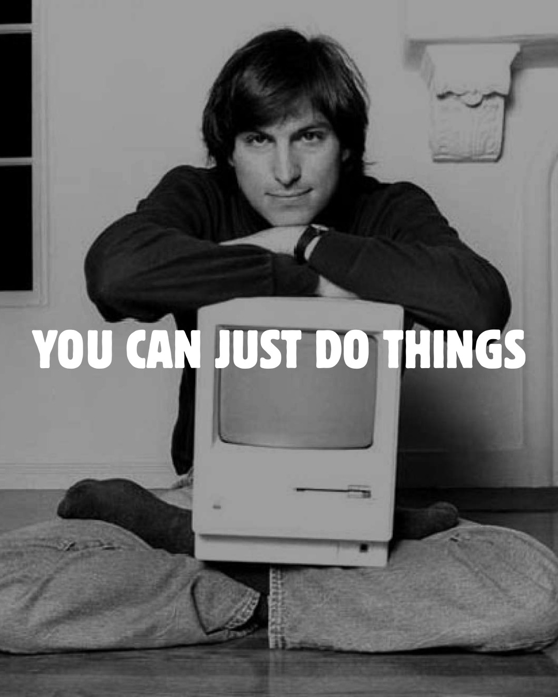

Nobody gave me permission to start a newsletter.

I made a Substack one evening and started writing. That became issue one. That was four years ago. I now run four newsletters simultaneously, none of which I planned in advance, none of which I waited to feel ready for.

**I sat down and did it.**

## The Planning Trap

People wait. They're always waiting for something;  a better month, a finished idea, a cleaner setup. I get it. But here's the thing about waiting: it's very comfortable, and it produces nothing.

Six weeks into doing the thing badly, you'll feel ready. Not before.

**I am not an exceptional person. I have 24 hours, same as you.**

## What My 24 Hours Actually Look Like

Monday to Friday, I'm a Product Marketing Lead at WPManageNinja. Three WordPress products: Fluent Forms, Ninja Tables, FluentPlayer. Five-person content team I manage. Product marketing strategies, weekly reports to the CMO, cross-team meetings, cross-product coordination, community management, marketing communication, product releases. Nine to six, sometimes past that.

Then I go home to my wife and my three-year-old daughter. Spend time with them.

**Then I write.**

Every week, four newsletters go out. Weekly NishIsHere at [nishishere.com](https://nishishere.com) — 104+ issues, close to 2,000 Substack subscribers. WP More at [wpmore.net](https://wpmore.net) — 50 issues, 454 Substack subscribers, Spotify & YouTube podcast, two Shorts per issue. HighDegree\* Marketing at [serplabseo.com](https://serplabseo.com) — 30 issues, 640 LinkedIn newsletter subscribers, also on Substack, Medium, Spotify & YouTube. And NishNama, the Bangla version of NishIsHere, which goes to 11,000+ subscribers. Plus Curious Nish, a private weekly blog for myself and a few friends.

Each newsletter gets distributed across LinkedIn, X, Facebook, Instagram, Threads, Bluesky, Tumblr, subreddits, FB groups. Each one goes to Spotify and YouTube as an audio & video podcast.

I also have [nishat.blog](https://nishat.blog/writings/), [nishnama.com](https://nishnama.com), and a monthly meta-newsletter – [NicheNish on Beehiiv](https://nichenish.beehiiv.com/).

**One person. No personal team for any of this. The same 24 hours you have.**

## This Is Not A Productivity Post

**I'm not going to tell you to wake up at 5 am or batch your content or build a second brain.**

I started WP More because I wanted to write about WordPress. I started HighDegree\* Marketing because I had SEO and marketing things to say. I started NishNama because I had thoughts I wanted to share in Bangla and nowhere to put them. No research phase. No strategy doc. *I wanted to do it, so I did it.*

None of these started because conditions were right. They started because I stopped waiting for conditions to be right.

## What Actually Stops You

It's not time. You have pockets of time. You're spending them on something easier right now and that's fine, but don't call it a time problem.

It's not skill. *You build that by doing it badly first.* There's no other way.

It's not money. A newsletter costs nothing. A blog costs nothing.

What stops you is a voice that says you need more before you can start. More clarity, more confidence, a better plan. **That voice isn't helping you. It's just buying itself more time.**

## Why I Actually Keep Doing This

None of this feels like extra work because I'm not doing it to optimize anything. I like writing about WordPress. I like curating SEO and marketing reads. I like writing in Bangla. I like Curious Nish even though almost nobody reads it.

**When you do things you care about, the "where do you find the time" question doesn't quite land.**

You find time for things that matter. You stop finding time for things that don't.

**It doesn't feel like sacrifice.**

## So What's Stopping You

You have something you want to do. You've been sitting on it. Maybe a newsletter, a YouTube channel, a blog, a hobby project. You know what it is.

**You're waiting for something to change. It probably won't.**

You don't need a launch plan for month one. You don't need the full system figured out. You don't need to feel ready.

Open a tab. Do the first thing.

**You can just do things.**

With Love,

– Nishat Shahriyar
